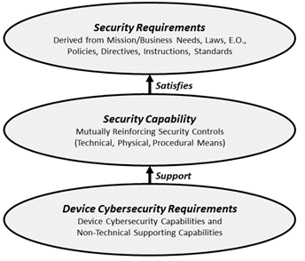

# Introduction
Internet of Things (IoT) devices may create new pathways in and out of the network systems within which they are used. These issues make controlling the secure use of IoT devices within networking systems a new and challenging task. It is also challenging when trying to identify and mitigate the cybersecurity risks and then effectively protect the associated IoT data, interfaces, and linked systems. NIST’s [Cybersecurity for the Internet of Things](https://www.nist.gov/programs-projects/nist-cybersecurity-iot-program) program aims to help manufacturers and Federal government agencies better understand IoT device cybersecurity capabilities and supporting non-technical manufacturer capabilities needed for IoT devices used by Federal government agencies. The Cybersecurity for IoT program defines those terms as follows:

* _Device Cybersecurity Capabilities_ are a set of technical device capabilities needed to support common cybersecurity controls that protect the customer’s devices and device data, systems, and ecosystems.

* _Supporting Non-technical Capabilities_ are a set of non-technical supporting capabilities generally needed from manufacturers or other third parties to support common cybersecurity controls that protect an organization’s devices as well as device data, systems, and ecosystems. 

Both device cybersecurity capabilities and non-technical supporting capabilities are vital to customer organizations’ ability to implement controls that the organization has allocated for their information systems. The figure below illustrates how device cybersecurity capabilities and non-technical supporting capabilities (grouped together as ‘Device Cybersecurity Requirements’) support system/organizational security capabilities, which in turn satisfy organizational security requirements.

